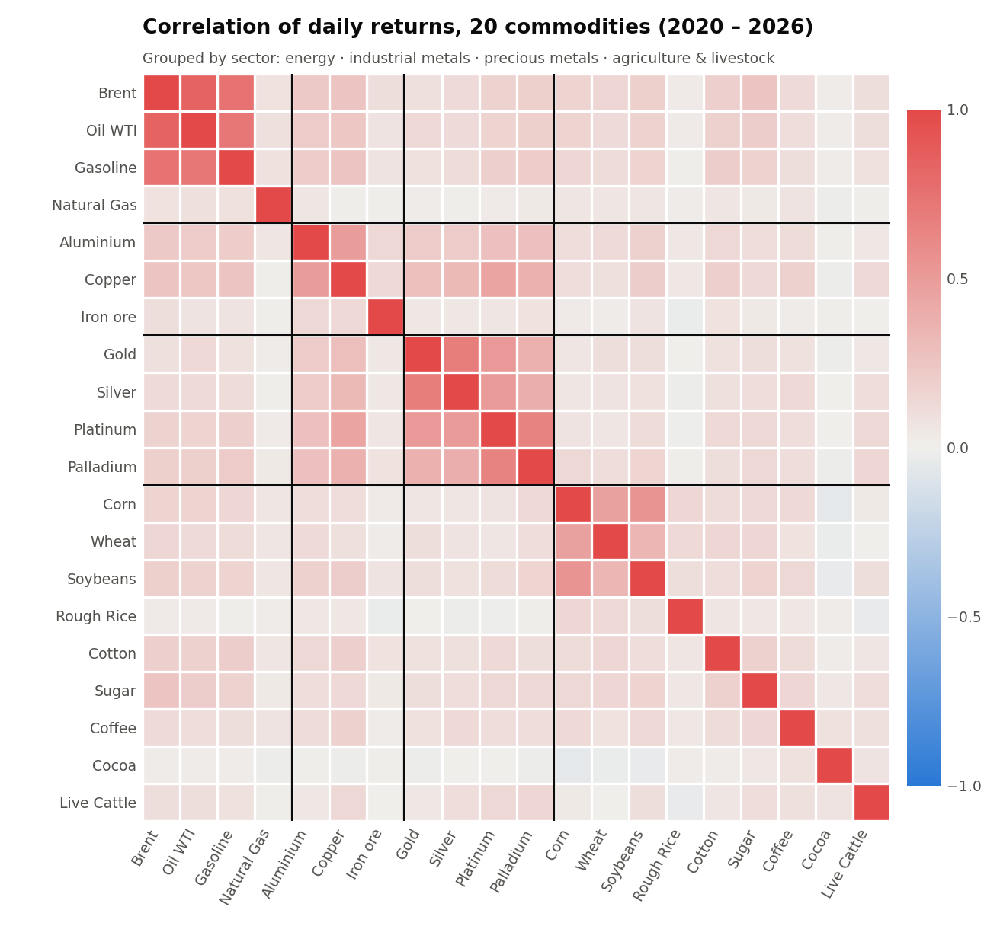
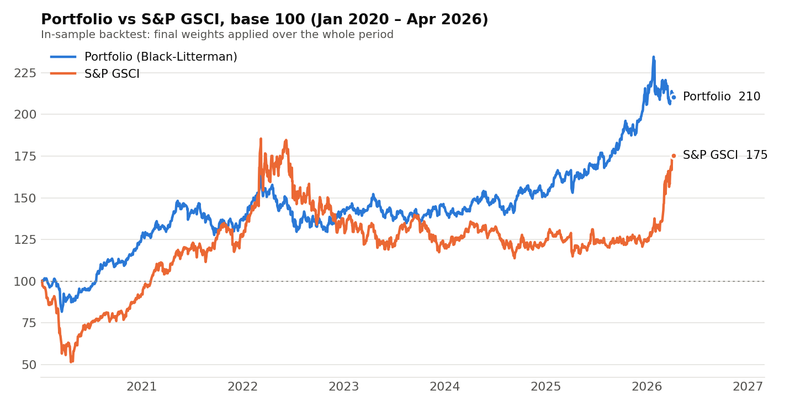

# Commodity portfolio allocation (ESILV, 2025–2026)

Long-only allocation across 20 commodity futures, built as a team project during my engineering degree at ESILV (PII project, Financial Engineering major).

The code is in a private team repository. This page describes the project and its results. I'm happy to walk through the code in an interview.

## My part

I was in charge of the data and of choosing the assets:

- a Python script that downloads daily closing prices from Yahoo Finance for 20 futures and the S&P GSCI, then updates the dataset incrementally (only the missing days, up to T-1, skipping tickers with no data);
- the choice of the 20 commodities, based mainly on their correlations, so that the portfolio covers the four sectors without piling up assets that move together.

I also helped with part of the modelling in R.

## Data

Daily prices from January 2020 to April 2026 (about 1,630 trading days):

- Energy: Brent, WTI, gasoline, natural gas
- Industrial metals: aluminium, copper, iron ore
- Precious metals: gold, silver, platinum, palladium
- Agriculture and livestock: corn, wheat, soybeans, rough rice, cotton, sugar, coffee, cocoa, live cattle

The oil complex is highly correlated (Brent/WTI around 0.84), and so are the precious metals. Across sectors, most correlations stay below 0.3, which is where the diversification comes from.

## Method

1. **Return views with ARIMA.** One model per asset, order chosen by AIC, giving a one-day-ahead forecast that is annualised into a view.
2. **Volatility with GARCH(1,1)** (Student-t errors), for a one-day-ahead conditional volatility per asset.
3. **Covariance matrix.** Ledoit-Wolf shrinkage on historical returns, blended with a GARCH-based conditional covariance.
4. **Black-Litterman allocation.** The ARIMA views are combined with an equilibrium prior. The uncertainty of each view depends on how confident the model is. Optimisation under long-only constraints, weights summing to 100%.
5. **Downside overlay.** Weights are reduced on assets with high downside volatility, then re-optimised on the Sortino ratio using Monte Carlo scenarios.
6. **Reporting.** Risk report (volatility, drawdown, Sharpe, correlations) and portfolio report exported to Excel.

Stack: Python (pandas, NumPy, SciPy, statsmodels, arch, PyPortfolioOpt, yfinance, openpyxl).

## Results

| Jan 2020 – Apr 2026 | Portfolio | S&P GSCI |
|---|---|---|
| Annualised return | 12.6% | 9.4% |
| Annualised volatility | 14.6% | 24.3% |
| Sharpe ratio (rf = 0) | 0.86 | 0.48 |
| Maximum drawdown | −21% | −49% |

**Limitation.** These numbers come from an in-sample backtest: the weights estimated with data up to April 2026 are applied over the whole period, so the portfolio benefits from information it would not have had in 2020. The honest comparison is a walk-forward backtest, re-estimating the models and the weights every month with past data only. That is the next step I would take.

## What I took from it

- Building a clean, self-updating dataset takes more time than expected, and every model downstream depends on it.
- Correlations change over time, so an asset selection based on them has to be checked again when market conditions shift.
- A good-looking backtest needs to be questioned before it is trusted.

---
Eric Mothe · [LinkedIn](https://linkedin.com/in/eric-mothe) · mothe.eric@gmail.com
